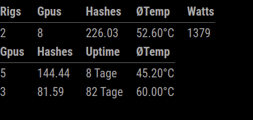
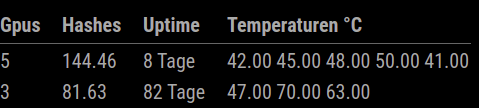

# MMM-Ethos

This is a module for the [MagicMirror²](https://github.com/MichMich/MagicMirror/).

This module shows stats from ethosdistro.com api.<br/> <br/> 
### Show summary and rigs
 &nbsp;&nbsp; 
<br/> <br/> 
### Show rigs and all temps

## Installing the module
Clone this repository in your `~/MagicMirror/modules/`:
````javascript
git clone https://github.com/Defjam121/MMM-Ethos.git
````

## Custom Panel ID
To get a api link, you must setting a custom Panel id on all your rigs. [Setting a Custom Panel ID](http://ethosdistro.com/kb/#custompanel)

## Using the module

To use this module, add the following configuration block to the modules array in the `config/config.js` file:
```js
var config = {
    modules: [
        {
            module: 'MMM-Ethos',
            position: 'top_left',
            config: {
                ethosApiLink: 'http://<Your_Sub_Domain>.ethosdistro.com/?json=yes'
            }
        }
    ]
}
```


## Configuration options

| **Option** | **Default** | **Description** |
| --- | --- | --- |
| `ethosApiLink` | `""` | *Required* <br/>The API link from the http://ethosdistro.com/
| `updateInterval` |  `60000` |*Optional* <br/>How often should the data be fetched. <br><br>**Type:** `int`(milliseconds)
| `allTemps` | `false` | *Optional* <br/> Boolean to show only average temp or all.
| `allHashes` | `false` | *Optional* <br/> Boolean to show only average hashes or all.
| `showUptime` | `true` | *Optional* <br/> Boolean to show uptime or not.
| `showWatts` | `true` | *Optional* <br/> Boolean to show watts or not.
| `showEveryRig` | `true` | *Optional* <br/> Boolean to show every rig or not.
| `showSummary` | `false` | *Optional* <br/> Boolean to show summary rigs or not.
